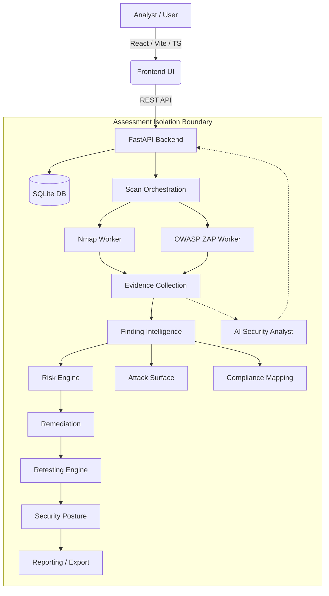
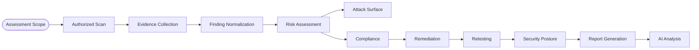
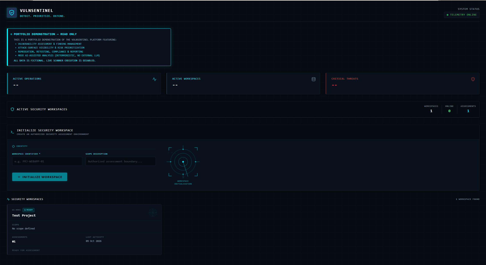
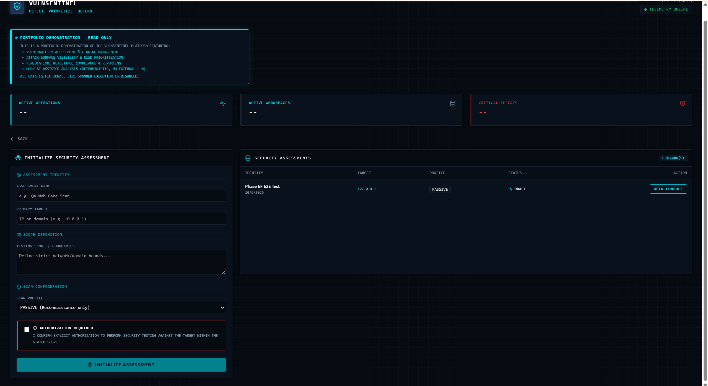
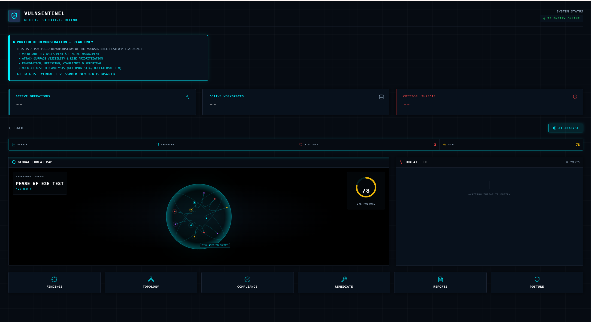
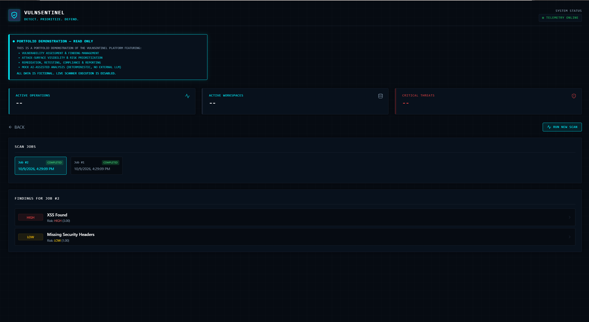
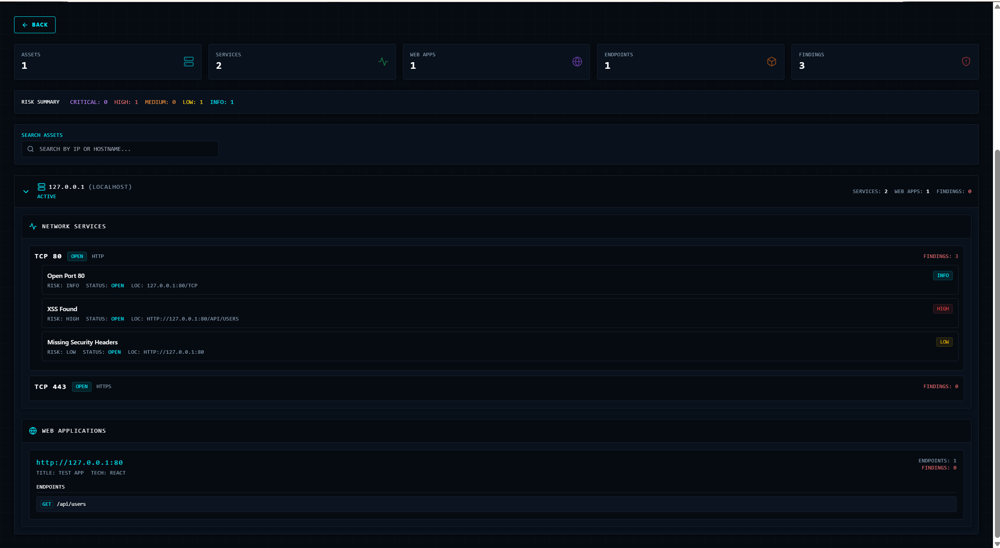
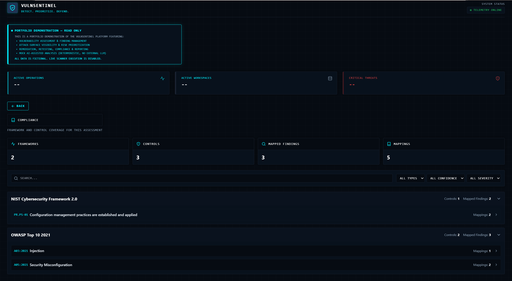
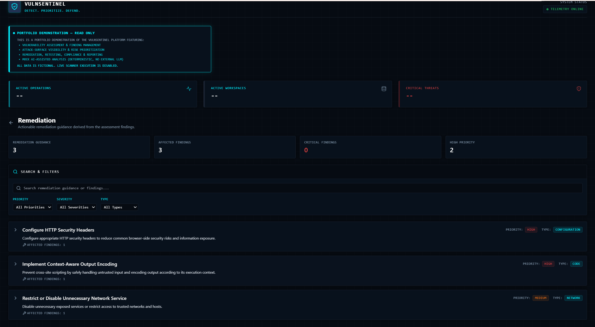

<div align="center">

# VulnSentinel — VAPT / WAPT Security Platform

**Evidence-driven vulnerability assessment, security intelligence, retesting, and reporting platform.**

```text
                 ◉
             ╱       ╲
          ╱     ◉     ╲
        │    ╱─────╲    │
        │   │  VAPT │   │
        │    ╲─────╱    │
          ╲      •     ╱
             ╲       ╱
                 ◉

        SECURITY ASSESSMENT ACTIVE
```


<br><br>

[Live Demo](#live-demo) • [Screenshots](#screenshots) • [Architecture](#security-architecture) • [Security Engineering](#security-engineering-highlights) • [AI Analyst](#ai-security-analyst) • [Demo](#local-demo) • [Installation](#running-the-platform)

</div>

---

## Overview

Modern vulnerability scanning often produces disconnected, noisy outputs. The VAPT/WAPT Security Assessment Platform solves this by providing a unified cybersecurity engineering console. It wraps raw scanner capabilities (Nmap, OWASP ZAP) in a deterministic intelligence layer that normalizes findings, deduces risk, maps compliance, preserves immutable evidence, and safely scopes AI-assisted security analysis within strict assessment boundaries.

## Key Capabilities

- **Assessment Management**: Strict scoping and authorization tracking for target environments.
- **Scope / Authorization Controls**: Verifies targets before scan execution.
- **Scanner Integration**: Modular workers for Nmap and OWASP ZAP.
- **Finding Normalization & Deduplication**: Merges overlapping observations from multiple scanners deterministically.
- **Risk Scoring**: Immutable backend logic enforcing confidence-weighted severity ratings.
- **Attack Surface Intelligence**: Hierarchical asset mapping (Endpoints, Services, Web Apps).
- **Compliance Mapping**: Automated cross-referencing against OWASP Top 10 and NIST frameworks.
- **Remediation Guidance**: Deterministic, context-aware remediation instructions.
- **Retesting**: Tracks fixed/failed revalidation attempts while preserving original scan evidence.
- **Evidence Preservation**: Logs raw scanner output directly attached to specific finding lifecycles.
- **Security Posture**: Automated metric calculation of overall assessment health.
- **Historical Reporting**: Point-in-time snapshot generation with HTML/PDF export.
- **Secure Report Sharing**: One-way SHA-256 hashed share-links with expiration/revocation.
- **AI Security Analyst**: Read-only, context-bounded analysis over validated scan evidence (provider-based; the public demo uses a deterministic mock provider).

## Security Architecture



## Security Engineering Highlights

### Scanner Command Safety
Scanner integrations (e.g., `nmap.py`) are executed with Python's `subprocess.run` using argument arrays and `shell=False`, so shell metacharacters in a target are never interpreted by a shell. Because a target could still be misread by the scanner as a command-line option (for example `--script=...`), assessment targets are validated on creation, and the Nmap command builder rejects option-like targets (a leading `-`) and targets containing whitespace or control characters.

### Assessment Isolation
As of Phase 15A hardening, strict Object-Level Authorization boundaries are enforced. Cross-tenant access is structurally mitigated by ensuring that all direct-object retrievals (findings, retests, reports) validate `assessment_id` ownership constraints prior to resolving the requested entity.

### Evidence Integrity
Evidence structures maintain absolute ownership. An evidence log belongs exclusively to exactly one logical owner: a `Finding` (initial discovery) or a `RetestResult` (validation attempt). It cannot be orphaned or cross-polluted.

### Retesting Integrity
A finding is never marked "Fixed" merely because a secondary scan failed to connect. The retesting engine explicitly requires positive scanner confirmation of the absent vulnerability, avoiding false-negatives in remediation tracking.

### Report Immutability
Generated security reports capture a deep-copied JSON snapshot of the assessment state. Future modifications to the live database (e.g., a finding being closed later) do not silently retroactively alter a finalized historical report.

### Share-Link Security
Public report share links rely on cryptographically secure random token generation (`secrets` module). The database only persists a one-way `SHA-256` token hash, neutralizing the impact of potential database read-leaks.

### AI Security Boundaries
The AI feature is strictly a read-only reasoning layer, not an autonomous agent. It operates within a secure Context Builder that:
- Isolates context exclusively to the authorized assessment boundary.
- Operates in strict read-only mode (cannot execute commands or alter DB state).
- Programmatically strips fabricated "hallucinated" entity references before returning payloads to the client.
- Performs all provider orchestration server-side, never exposing API keys to the client.

## AI Security Analyst

The AI feature provides **evidence-grounded security analysis rather than autonomous security execution.** 

Instead of allowing an LLM to indiscriminately scan targets or mutate finding states, the AI acts as an explanation layer. The system feeds the AI a tightly bounded, sanitized JSON context window of confirmed finding evidence. The AI then structures a deterministic response (via Pydantic schema validation) to help analysts interpret complex vulnerability chains. The AI's recommendations **do not** replace the deterministic risk engine or human analyst verification.

## Feature Workflow



## Tech Stack

**Frontend:**
- React (18)
- Vite
- TypeScript
- Tailwind CSS

**Backend:**
- FastAPI
- Pydantic
- SQLAlchemy
- Python `unittest`

**Database:**
- SQLite (Development)

**Scanning Engines:**
- Nmap
- OWASP ZAP (Local API Integration)

## Project Structure

```text
vapt-wapt-platform/
├── backend/
│   ├── app/              # FastAPI application
│   │   ├── api/          # REST routers
│   │   ├── models/       # SQLAlchemy models
│   │   ├── schemas/      # Pydantic schemas
│   │   ├── services/     # Reporting, posture, retest and AI analyst engines
│   │   ├── risk/         # Risk scoring engine
│   │   └── worker/       # Scanner adapters, normalization, correlation, compliance and remediation mapping
│   ├── test_*.py         # Python unittest suite
│   └── requirements.txt
├── frontend/
│   ├── src/              # React/TypeScript source (components, views)
│   ├── tailwind.config.js
│   └── package.json
├── docs/                 # Architecture and security documentation
├── docker-compose.yml    # Placeholder only; not used yet
├── LICENSE
└── README.md
```


## Live Demo

**Live read-only demo: [vapt-wapt-platform.vercel.app](https://vapt-wapt-platform.vercel.app/)**

The hosted demo uses fictional data only. Live scanner execution is disabled, and the AI analyst runs as a deterministic mock provider (no external LLM).

*Note: Demo mode operates in a strict read-only boundary. Scanner execution and mutations are prevented by a server-side request boundary in demo state.*

## Local Demo

To test the platform safely, you can spin up a local instance of OWASP Juice Shop as an authorized target. **Do NOT scan targets you do not own or are not explicitly authorized to assess.**

```bash
docker run -d --name juice-shop -p 127.0.0.1:3000:3000 bkimminich/juice-shop
```
Once running, you can create a new Assessment in the platform with the target `127.0.0.1` and execute safe standard web scans against it.

## Running the Platform

### 1. Backend
Ensure Python 3.10+ is installed.
```bash
cd backend
python -m venv .venv
source .venv/bin/activate  # Or .venv\Scripts\Activate.ps1 on Windows
pip install -r requirements.txt
uvicorn app.main:app --reload --port 8000
```

### 2. Frontend
Ensure Node.js 18+ is installed.
```bash
cd frontend
npm install
npm run dev
```
The application will be accessible at `http://localhost:5173`.

## Testing

Run the tests from the `backend/` folder after installing `requirements.txt`:
```bash
cd backend
python -m unittest test_target_validation test_retest_api
```

**Targeted Security/Product Tests: PASS**
Targeted test execution successfully validates business logic (e.g., `python -m unittest backend.test_retest_api`).

**Full Test Suite: KNOWN LIMITATION**
Running the global discovery suite (`python -m unittest discover`) currently produces known teardown failures. This is due to a recognized infrastructural issue where FastAPI `dependency_override` lifecycle hooks leak across isolated in-memory SQLite fixtures during sequential execution.

**Frontend Build: PASS**
The React frontend compiles successfully (`npm run build`) with strict TypeScript enforcement.

## Current Limitations

- **No User Authentication/RBAC:** Authentication and user-level ownership are intentionally deferred for the current MVP portfolio scope. The platform securely isolates data vertically by `assessment_id`, but does not yet differentiate between distinct human users.
- **SQLite Development Environment:** The platform currently runs on SQLite. Production scaling would require swapping the SQLAlchemy engine to PostgreSQL.
- **Docker Compose is a placeholder:** `docker-compose.yml` only contains commented-out sketches; run the backend and frontend as described above.
- **Local ZAP test key:** The ZAP adapter defaults to a local test API key for a locally run ZAP instance. Use your own key and never expose ZAP publicly.
- **Known Test-Fixture Lifecycle Issue:** As noted above, global unittest runs exhibit teardown bleed.
- **AI Sanitization Limitations:** While the AI context engine truncates strings and strips basic secrets (e.g., `Bearer` tokens), it cannot definitively scrub every entropy-based secret from raw scanner evidence.

## Security Model

This platform is built on strict cybersecurity engineering principles:
- **Authorized Scanning Only:** The system requires explicit user confirmation of scope authorization before invoking scanner integrations.
- **Command Injection Prevention:** All scanners execute via array-based subprocesses; no dynamic shell strings.
- **Assessment Isolation:** Hardened API layer enforcing Object-Level Authorization checks on direct primary-key lookups.
- **Report Snapshot Integrity:** Finalized reports are immutable JSON clones, immune to downstream DB modifications.
- **AI Read-Only Boundary:** The AI layer is read-only by design: it cannot mutate findings or trigger scanner execution.

## Portfolio Value

This project was built to demonstrate complex security automation, deterministic security intelligence, and secure software design. Rather than merely rendering a generic CRUD dashboard, the platform elegantly handles the orchestration of hostile security tools (Nmap/ZAP) while enforcing strict evidence preservation, retesting logic, and safe AI containment.

## Screenshots

Captured from the live read-only demo (fictional data).

| | |
|---|---|
|  |  |
| **Workspaces:** scoped assessment environments | **Assessments:** authorization-gated scan setup |
|  |  |
| **Command center:** posture score, findings, risk | **Findings:** severity and risk score per scan job |
|  |  |
| **Attack surface:** assets, services, web apps, endpoints | **Compliance:** findings mapped to NIST CSF 2.0 and OWASP Top 10 |
|  | |
| **Remediation:** prioritized, finding-linked guidance | |

## Documentation Links

- [AI Security Analyst Architecture](docs/ai-security-analyst.md)
- [Security Posture Methodology](docs/security-posture.md)

## Deployment Status

The read-only portfolio demo is deployed on Vercel (frontend) with a seeded SQLite backend; scanners are disabled. A production deployment remains intentionally deferred.

### Recruiter Demo vs Production VAPT Platform
- **Recruiter Demo**: A safe, isolated, read-only viewer demonstrating the UI, workflows, and AI Analyst over a controlled local Juice Shop scan dataset. Scanner dispatch is disabled.
- **Production VAPT Platform**: Intentionally deferred. Requires isolated Celery/Redis workers, egress-firewalled VPCs, PostgreSQL, and OAuth/RBAC.
